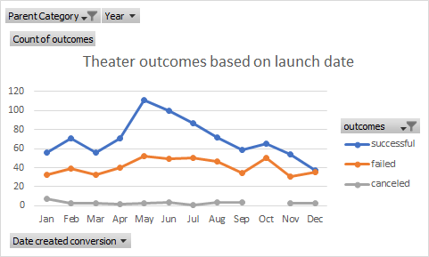
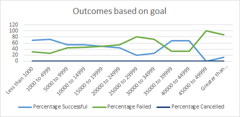

# Kickstarting with Excel

## A. Overview of Project

### This project is to analyze data from previous crowdfunding campaigns of the playwright Louise, for two purposes:
- Explore the correlation between theater campaign's launching dates and its' outcomes.
- Explore the correlation between theater campaign's funding goals and its' outcomes.  

## B. Analysis and Challenges

### B.1 Analysis of Outcomes Based on Launch Date

#### B.1.1 Methods
+ The analyst used `Year()` function to sort out Year of campaign to use it as a filter in Pivot table.
+ A Pivot table was created with raw data from Kickstarter worksheet. Filers were set by Year and Parent Category. The analyst placed outcomes in columns and value, date of create in rows. 
+ Pivot table was then filtered by year, category theater, and by outcomes to generate a line chart. 

#### B.1.2 Findings

- ***Winning months:***
	+ The **winner** month is **May** in which 111 out of 166 campaigns are successful *(66%)*.
	+ The **first and second runner-up** are **June and July** with 100 out of 153 *(65%)* and 87 out of 138 *(63%)* campaigns are successful respectively.
	+ The **third highest** months are **August, February** and **April** in which successful campaigns accounts from *(59%)* to *(62%)*.
- ***Failing months:***
	+ **May** also has the **highest** amount of **failed** campaigns, 52 out of 166. *(31%)*.
	+ **July** and **October** have the **second highest** amount of **failed** campaign, 50 out of 138 *(36%)* and 65 out of 115 *(43%)* respectively.
	+ **June** has the **third highest** amount of failed campaigns, 49 out of 153 *(32%)*.
- ***Canceled months:***
	+ Cancellation amount is pretty the same along the year with 3 exceptions: 
		1. **January** has the **highest cancellation**,7 of 96 campaigns *(7.3%)*.
		2. **July** has the **second lowest cancellation**, only 1 in 138 campaign *(0.72%)*.
		3. **October** has no cancellation. 

### B.2 Analysis of Outcomes Based on Goals

### B.2.1 Method
+ The analyst created a new sheet with different goal ranges in the first columns to store data. 
+ Used function `COUNTIFS()`to count numbers of successful, failed and canceled campaigns on the raw data sheet Kickstarter, based on different goal ranges.
+ Used function `SUM()` to calculate total projects by adding numbers of successful, failed and canceled projects.
+ Calculated percentage of each project outcomes and used `ROUND()` to have the percentage without decimal.
+ Created a line chart to visualize result.

### B.2.2 Findings

- ***B.2.1 Winning goals:***
	+ Campaigns that has the **highest successful** percentage *(73%)* have goals ranging from **$1,000 to $4,999**.
	+ Campaigns with goals **under $1,000** has the **second highest successful** percentage *(69%)*.
	+ Campaigns with goals from **$35,000 to $39,000** and from **$40,000 to $44,999** are those have the **third highest** successful percentage *(67%)*.
- ***B.2.2 Failing goals:***
	+ The **highest failing** percentage *(100%)* falls to campaigns with goal from **$45,000 to $49,000**.
	+ The **second highest failing** percentage *(88%)* is of campaigns whose goals is over **$50,000**.
	+ Campaigns with goal from **$25,000 to $29,000** have the **third highest** failing percentage *(80%)*.
- ***B.2.3 Cancellation:***
	+ There is no cancellation across all goal ranges. 

## C. Challenges and Difficulties Encountered

### C.1 Pivot table for B.1 analysis (Outcomes vs. Launch Dates)
+ Choosing the right fields to put into the right areas was a bit difficult for new Pivot table user. 
+ The analyst had to try putting the fields around, failed and tried in order to get the right table. 
### C.2 `COUNTIFS()` function for B.2 analysis (Outcomes vs. Goals)
+ This function was confusing when using with 2-number ranges like from 5,000 to 9,999.
+ The analyst added the second number as did with the first number but the formula failed. `=COUNTIFS(Kickstarter!D:D,">=5000"**,**Kickstarter!D:D,"<=9999"...)`
+ Then she realized there must be a space between 2 selections in order for the function operate. `=COUNTIFS(Kickstarter!D:D,">=5000"**, **Kickstarter!D:D,"<=9999"...)`
   
## D. Results

### D.1 Outcomes based on Launch Date

+ ***Ideal months:*** Summer is a good season to create crowdfunding campaign for theater. The ideal months are **May, June and July** because of 3 reasons:
	- They have the highest number of successful campaigns. 
	-  Although these 3 months have relatively high failed campaigns in comparison with the other months, the number of failed campaigns is just about 1/2 of the number of successful campaigns in the same months.
	-  Additionally, **July** has the second lowest cancellation number.

+ ****Bad months*:***
	- Although **October** has 0 cancellation, it is not a good month for crowdfunding because it has high failed number and that failed number is nearly equal the successful number in the same month. *(50 vs 65)*
	- **January** is the next bad month for crowdfunding. It has low successful number *(<60)*, high failed number and cancellation.

### D.2 Outcomes based on Goals
+ Successful campaigns have goals under $5,000. 
+ Higher failed percentage are of campaigns that have high goals from $45,000 to over $50,000

### D.3 Data set limitations
+ ***Outcomes based on launch dates:*** should have the percentage of successful, failed and canceled, not just the number of each outcome for more accurate analysis. 
+ ***Outcomes based on goals:*** Outcomes of the analysis in D.2 makes an impression that lower goals associate with higher successful percentage. However, the third highest failing goals is from $25,000 to $29,000 while one of the third highest successful goals is from $35,000 to $44,999. Apparently, dollar amount of goals is not a determinant in success. We should measure other data such as demographic and income of the participants for more thoughtful  analysis.

### D.4 Other possible tables and graphs

+ From the limitation of outcomes vs. launch date discussed above, we could create another table of program outcomes by percentage and create a chart based on that data.
